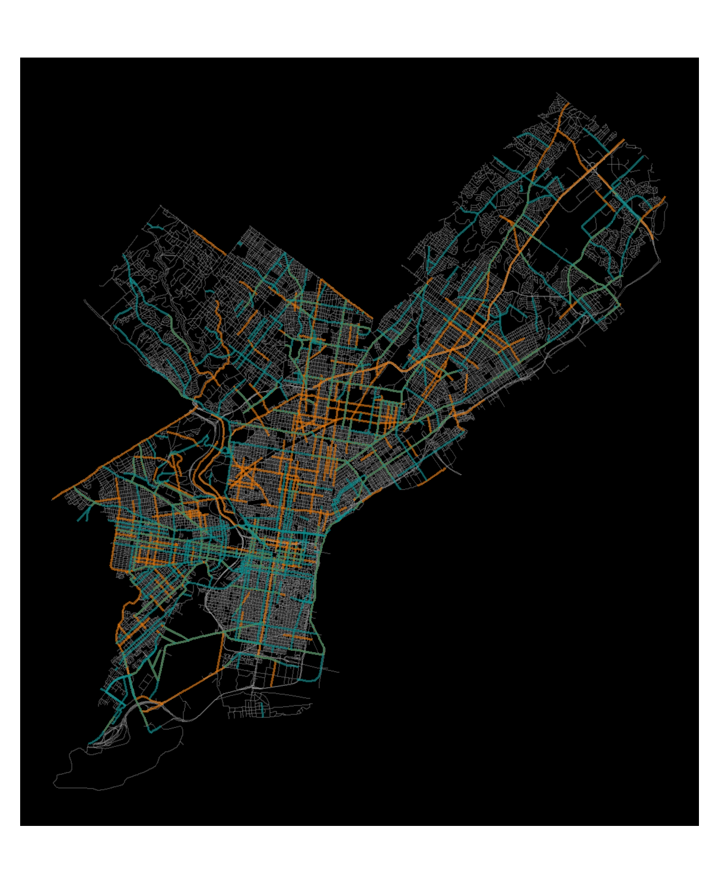
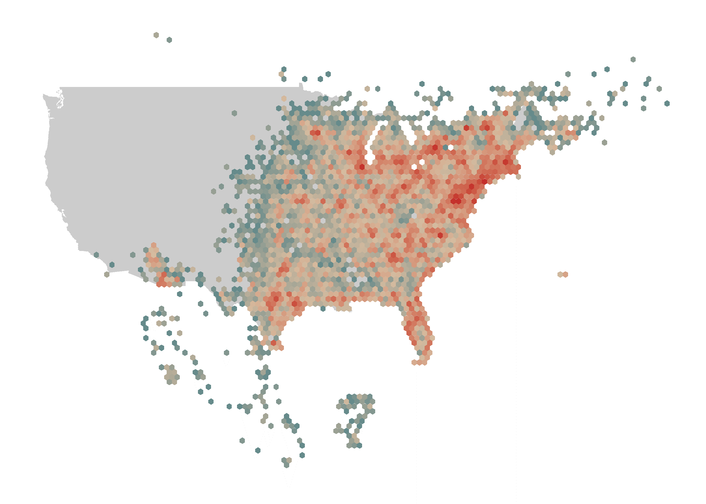
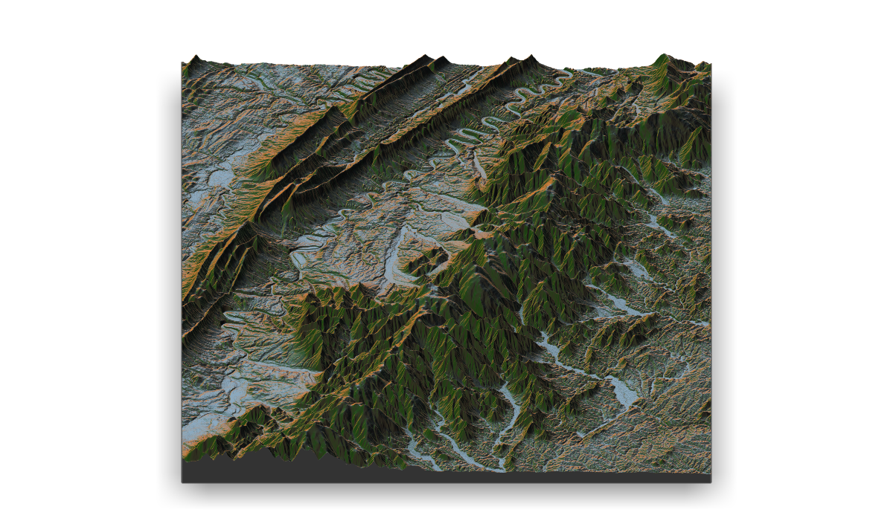

# 30DayMapChallenge 2022

## Day 1: Points

## Day 2: Lines

## Day 3: Polygons

## Day 4: Hexagons

## Day 5: OpenStreetMap

## Day 6: Red

## Day 7: Green

## Day 8: Blue

## Day 9: Monochrome

## Day 10: Raster

## Day 11: 3D

## Day 12: Population

## Day 13: Natural Earth

## Day 14: New tool

## Day 16: Urban / rural

## Day 17: Land

## Day 18: Water

## Day 19: Islands

## Day 20: Movement

## Day 21: Elevation

## Day 22: Boundaries

## Day 26: Choropleth

<<<<<<< HEAD
## Day 28: The Earth is not flat

=======
## Daily Challenge Images
## Day 10: raster

## Day 11: 3D

## Day 12: population

## Day 13: natural earth

## Day 14: new tool

## Day 16: urban rural

## Day 17: land

## Day 18: water

## Day 19: islands

## Day 1: points

## Day 20: movement

## Day 21: elevation

## Day 22: boundaries

## Day 26: choropleth

## Day 28: flat earth

## Day 2: lines

## Day 31: test

## Day 3: polygons

## Day 4: hexagons

## Day 7: green

## Day 8: blue

## Day 9: monochrome

>>>>>>> 45e52d70fdf249cf9260e202aeefda8944fe93a0
