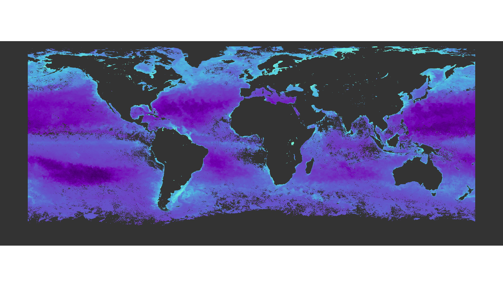
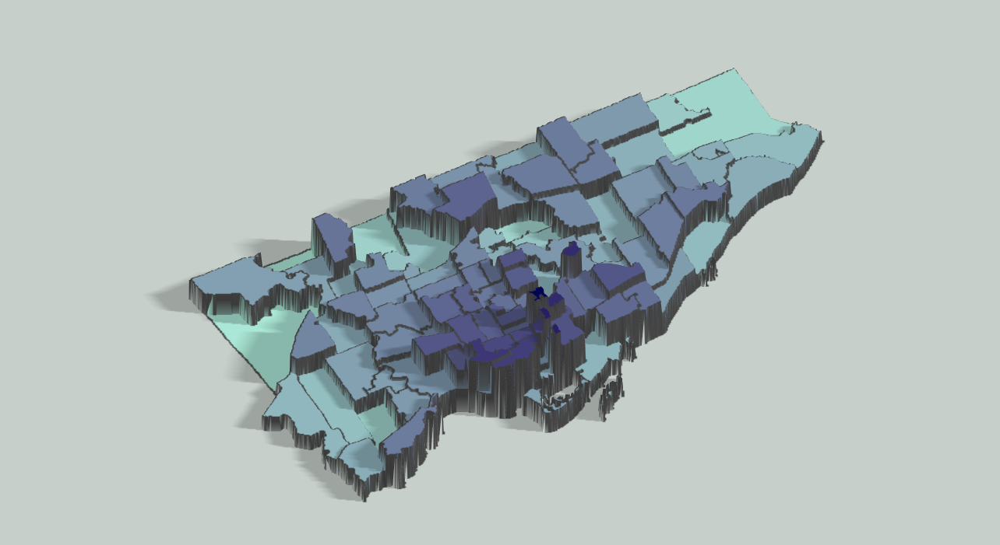
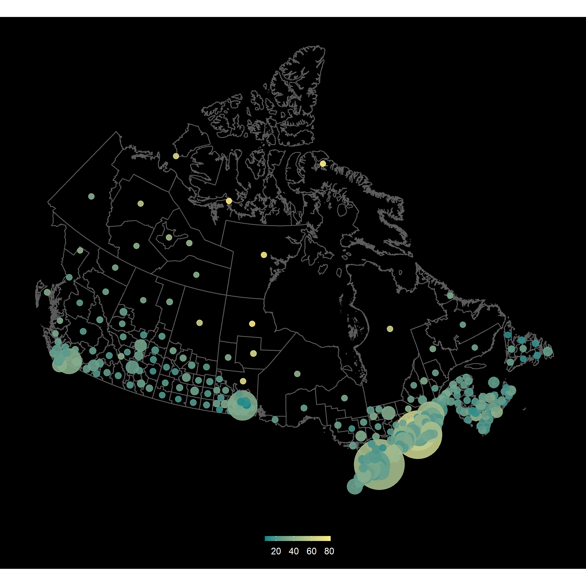
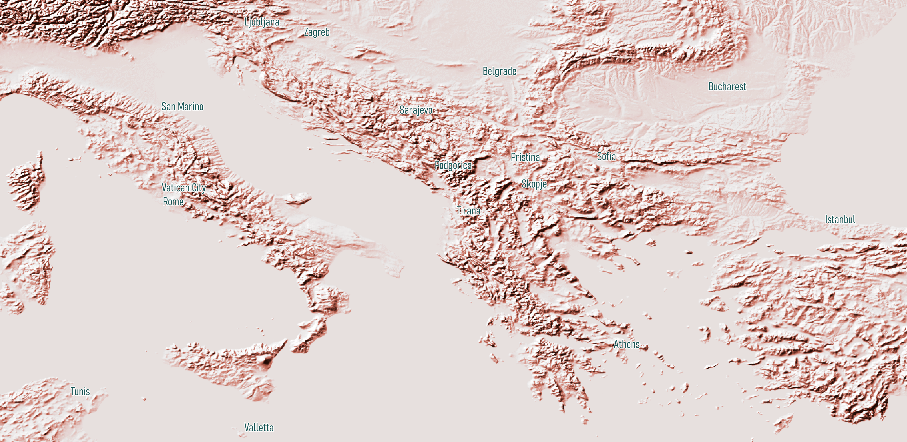
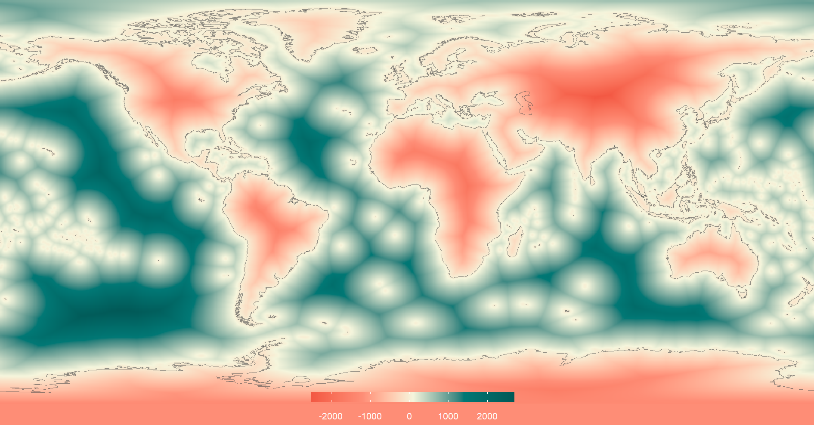
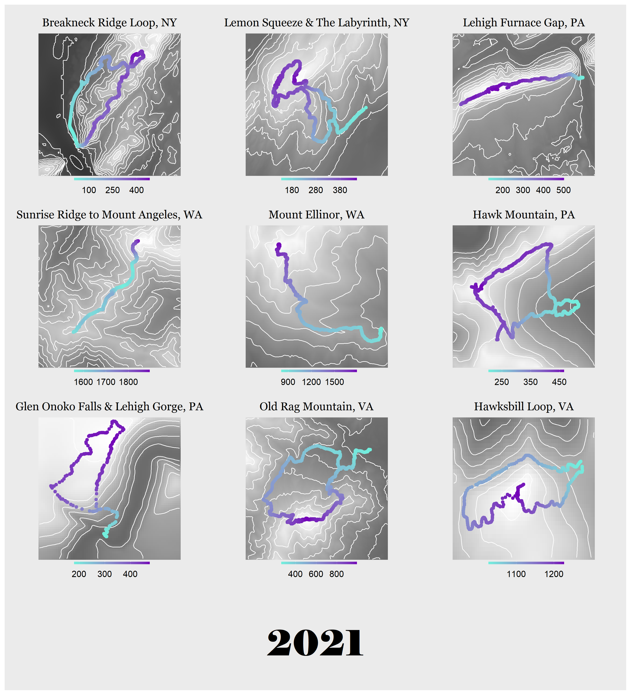

# 30DayMapChallenge 2021
The details of the challenge can be found [here](https://github.com/tjukanovt/30DayMapChallenge).  
For a post containing all maps in one place and links to all my data sources, click [here](https://ivabrunec.github.io/30daymap). I also included a link to the data source in each of my scripts (found in /scripts).  

## Day 1: Points

## Day 2: Lines

## Day 3: Polygons

## Day 4: Hexagons

## Day 6: Red

## Day 7: Green

## Day 8: Blue

## Day 9: Monochrome

## Day 10: Raster

## Day 11: 3D

## Day 12: Population

## Day 13: Natural Earth

## Day 14: Map with a new tool

## Day 15: Map without a computer

## Day 16: Urban/Rural

## Day 17: Land

## Day 18: Water

## Day 19: Islands

## Day 20: Movement

## Day 21: Elevation

## Day 22: Boundaries

## Day 26: Choropleth

## Day 28: The Earth is not flat

## Day 29: NULL
