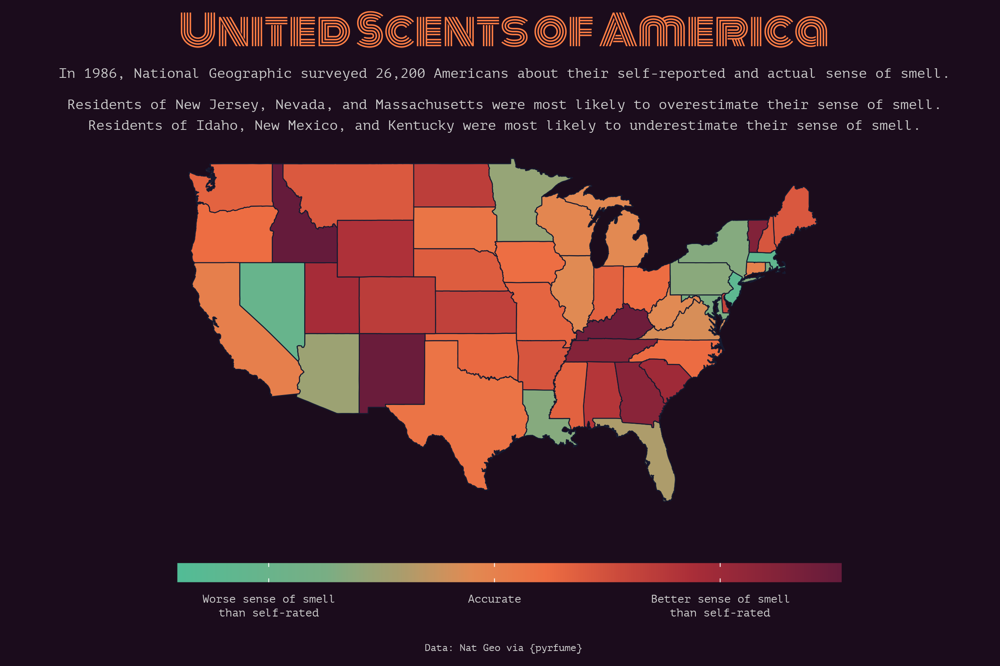
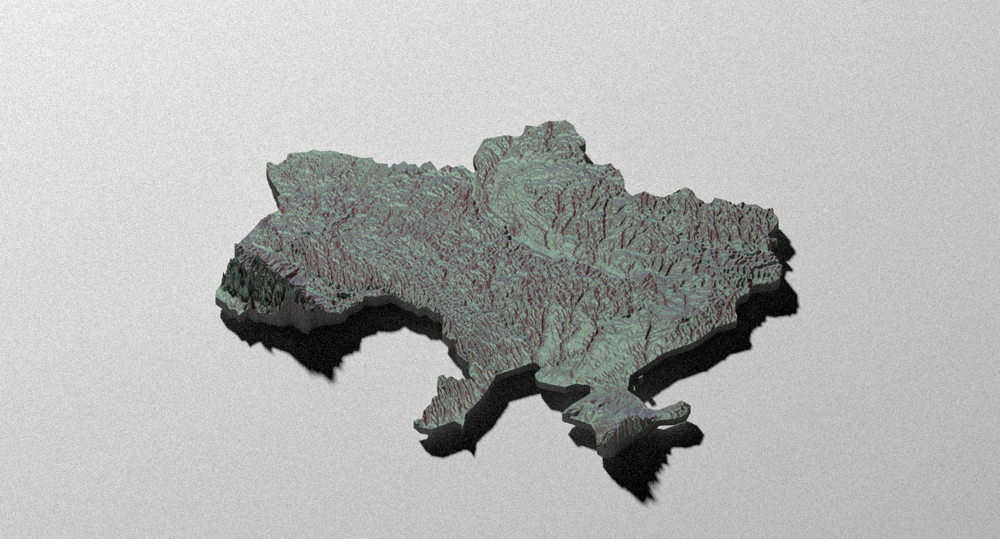
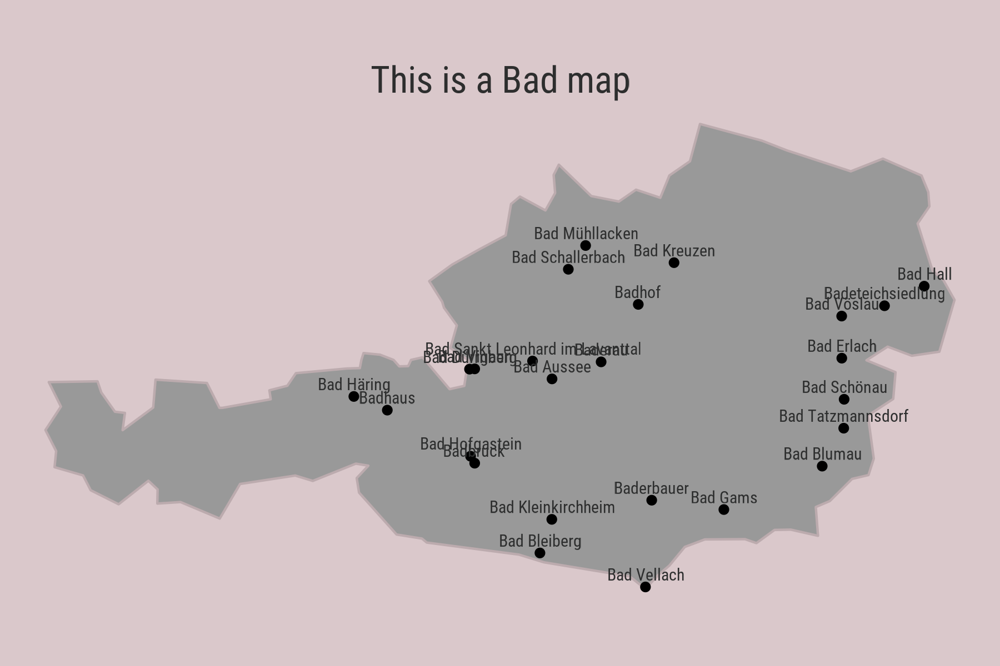
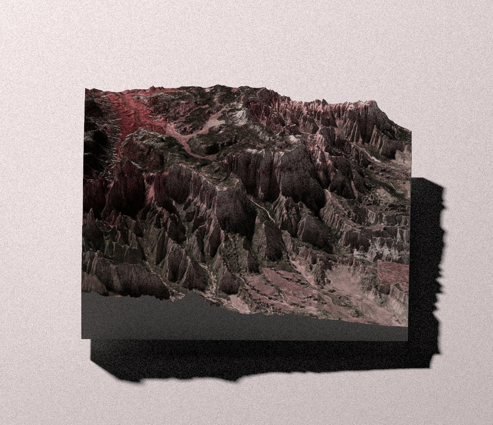
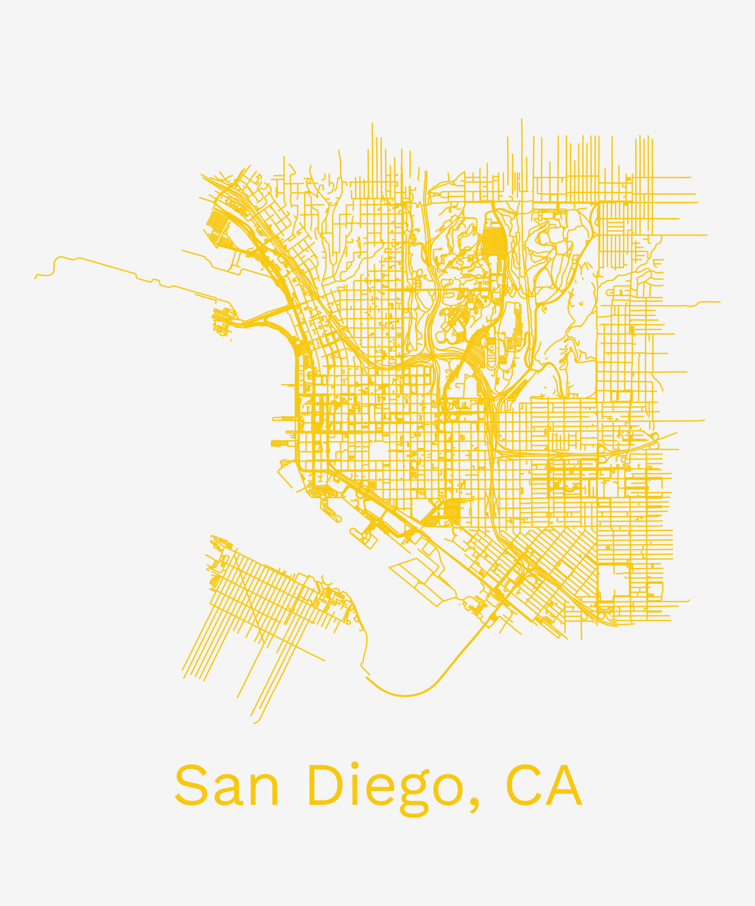
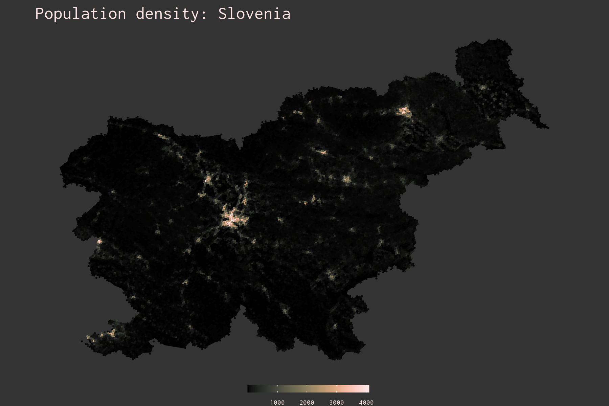
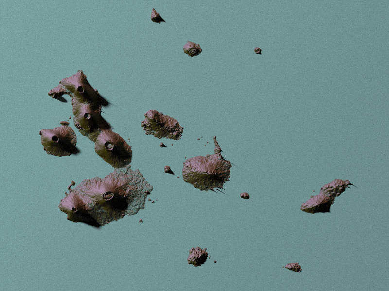

# 30DayMapChallenge 2022
The details of the challenge can be found [here](https://github.com/tjukanovt/30DayMapChallenge).  

For a post containing all maps in one place and links to all my data sources, click [here](https://ivabrunec.github.io/30daymap). 

## Day 1: Points

## Day 2: Lines

## Day 3: Polygons

## Day 4: Colour Friday: Green

## Day 5: Ukraine

## Day 7: Raster

## Day 8: OpenStreetMap

## Day 9: Space

## Day 10: A Bad Map

## Day 11: Colour Friday: Red

## Day 13: 5-Minute Map

[Link to video](day_13_5_min_map/day13_5min_recording.mp4)

## Day 14: Hexagons

## Day 16: Minimal

## Day 18: Colour Friday: Blue

## Day 19: Globe

## Day 20: My Favourite

## Day 21: Kontur Dataset

## Day 24: Fantasy

## Day 25: Colour Friday: Two Colours

## Day 26: Islands

## Day 27: Music

## Day 28: 3D
