# 30DayMapChallenge 2023

All maps from this year's challenge:

## Day 1: Points
[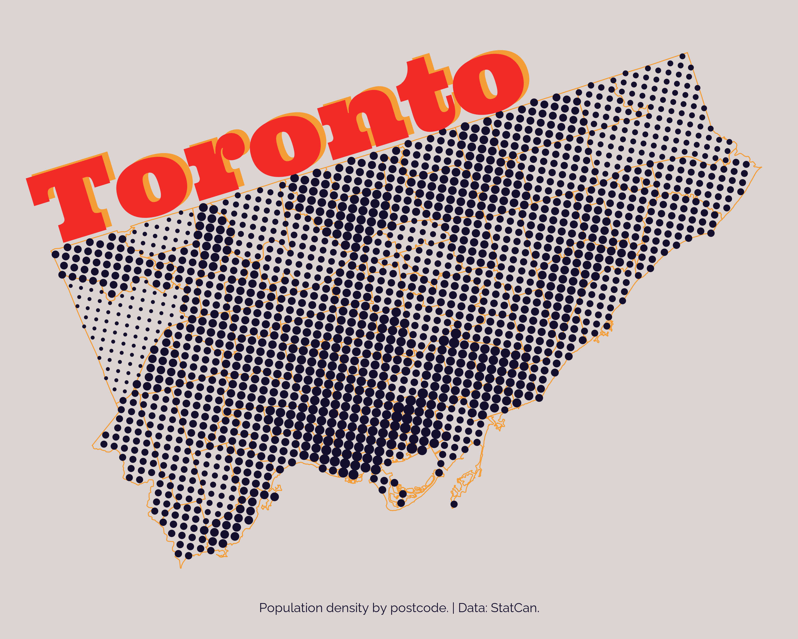](day_1_points/)

## Day 2: Lines
[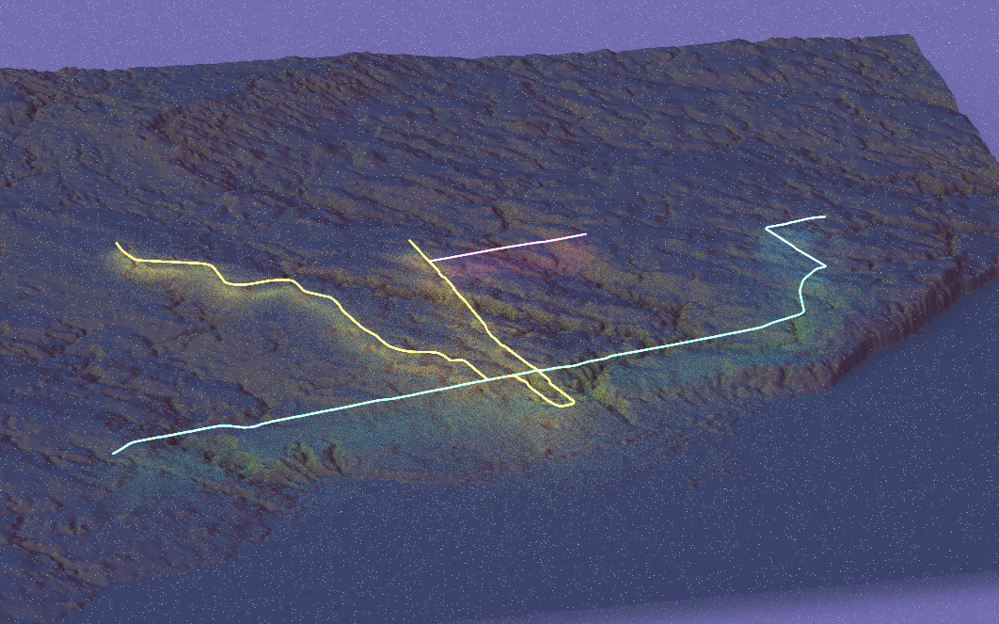](day_2_lines/)

## Day 6: Asia

## Day 7: Navigation
[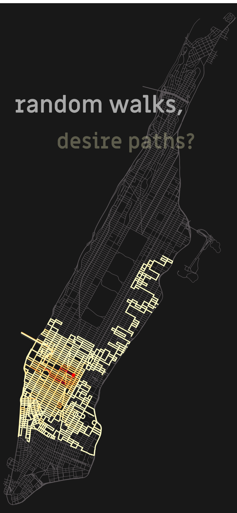](day_7_navigation/)

## Day 11: Retro
[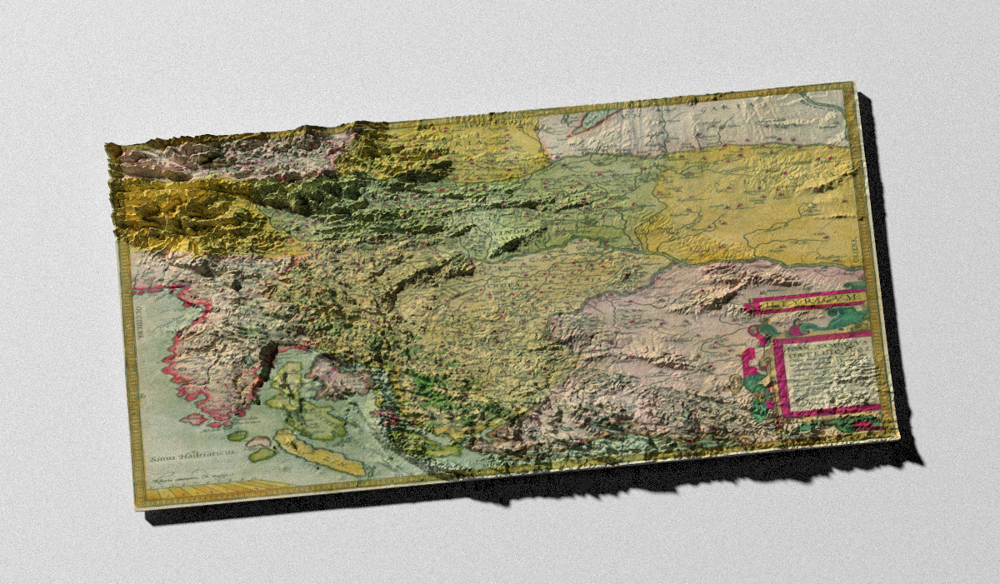](day_11_retro/)

## Day 12: South America
[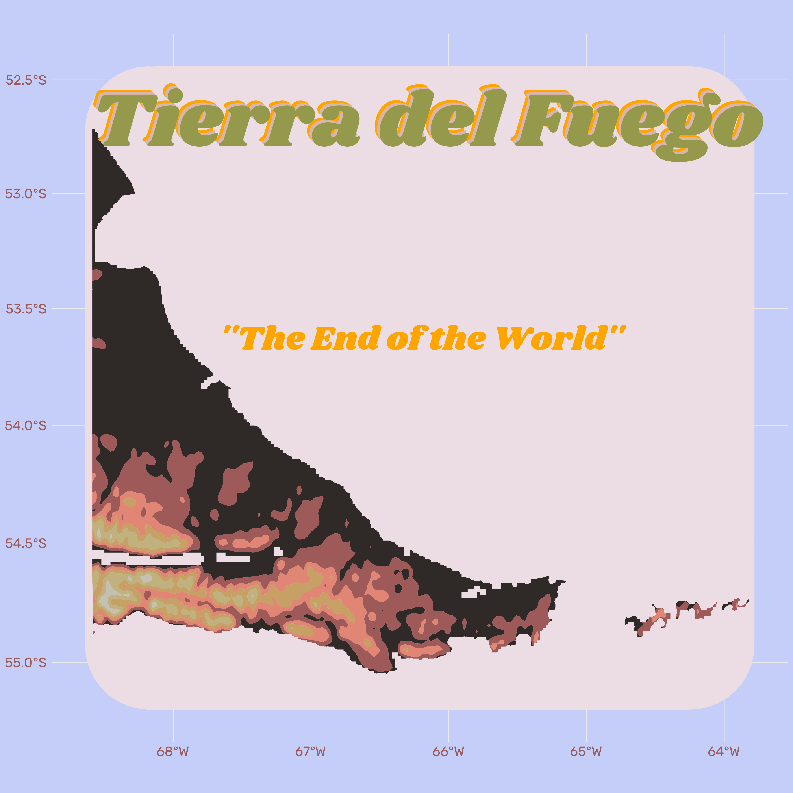](day_12_south_america/)

## Day 16: Oceania
[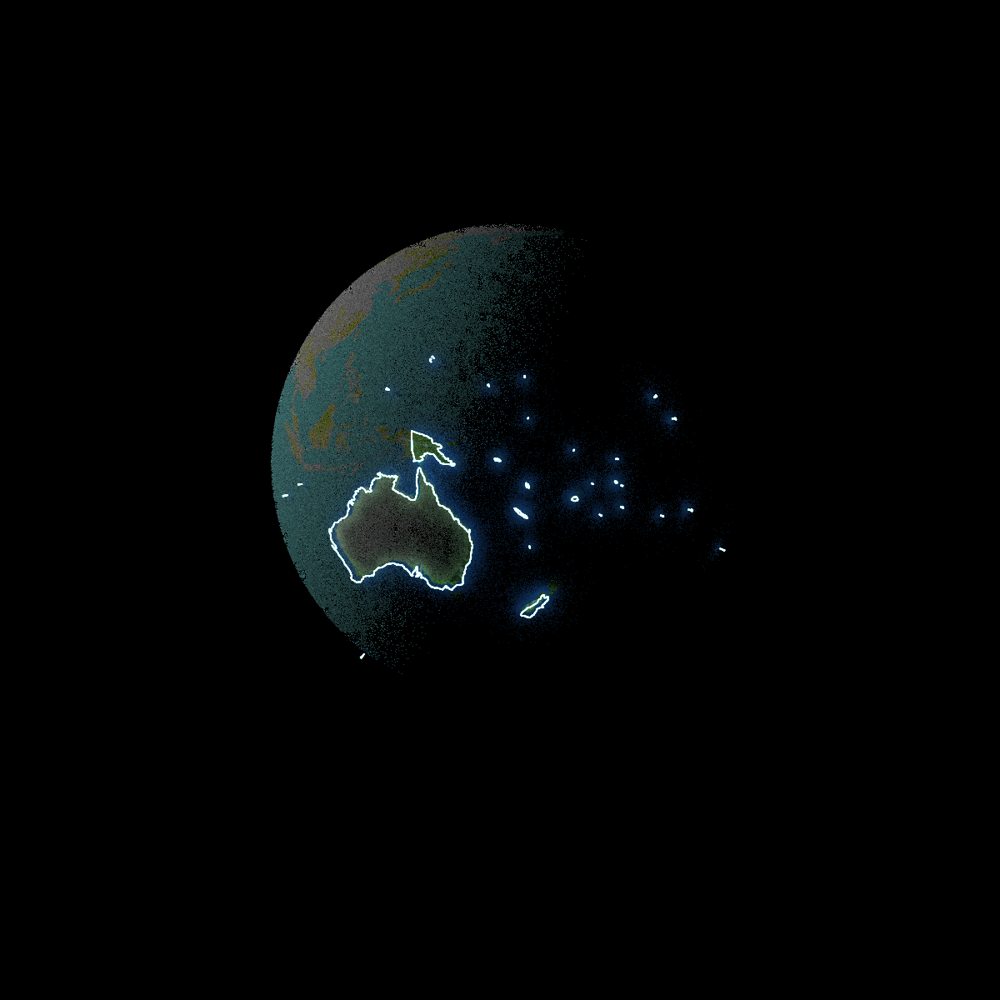](day_16_oceania/)

## Day 19: 5-minute map
[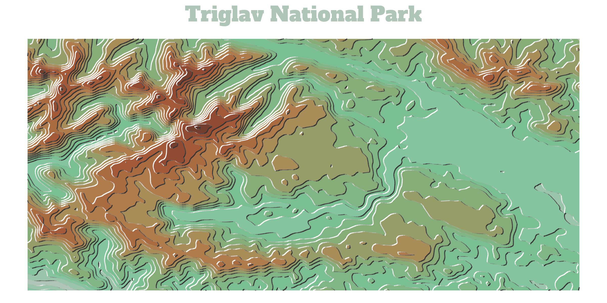](day_19_5_minute_map/)

## Day 23: 3D
[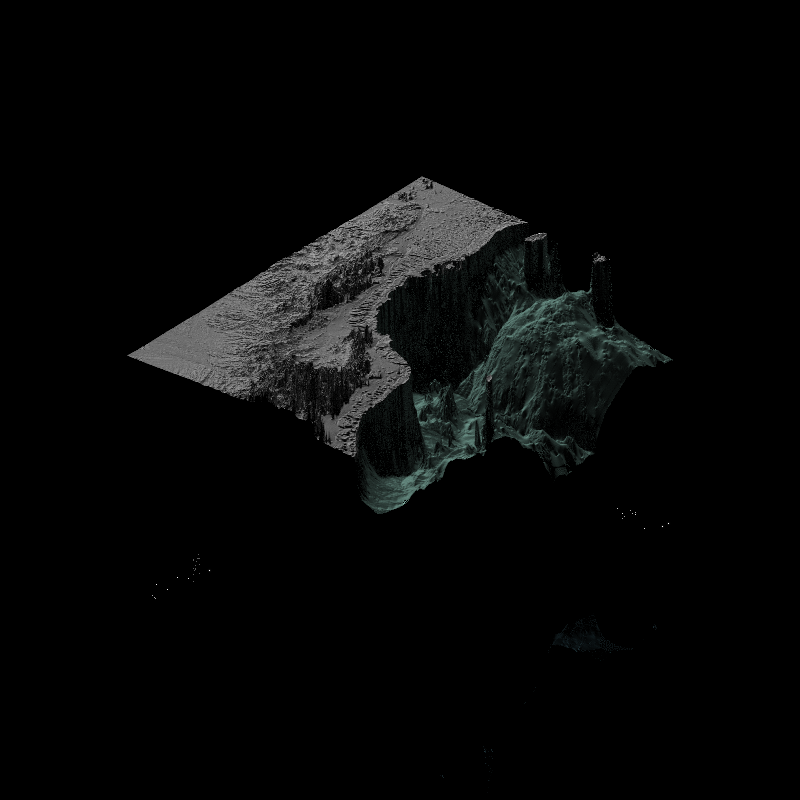](day_23_3d/)

## Day 24: Black & white
[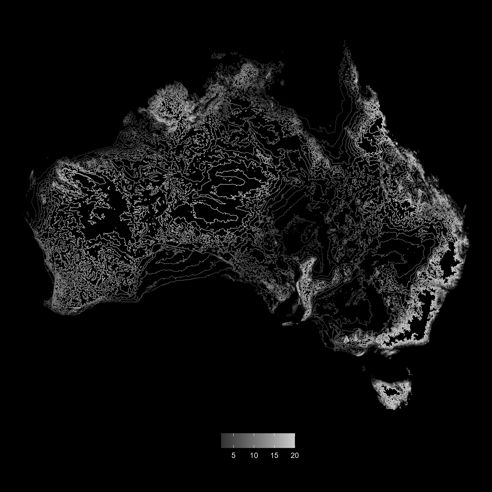](day_24_bw/)

## Day 26: Minimal
[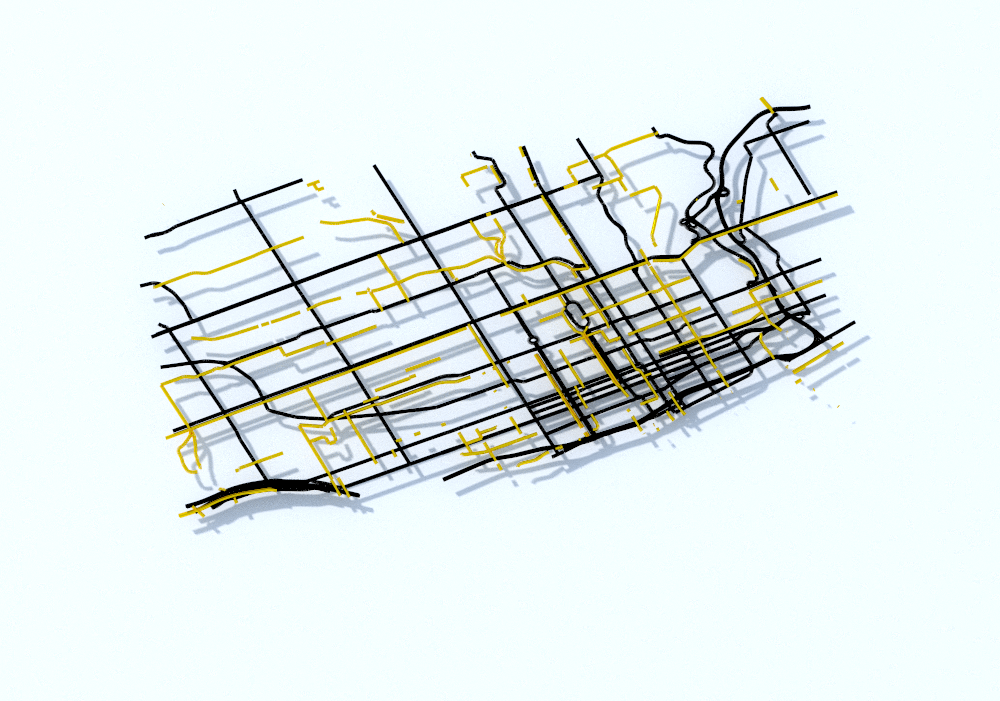](day_26_minimal/)

## Day 29_population
[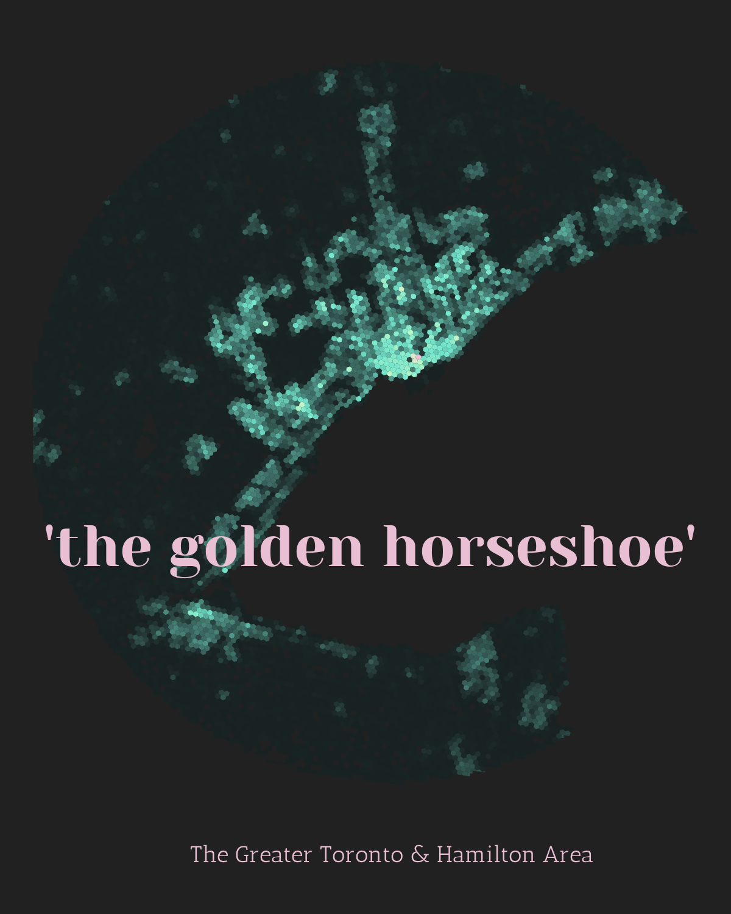](day_29_population/)
